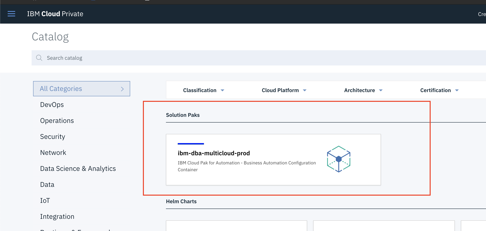
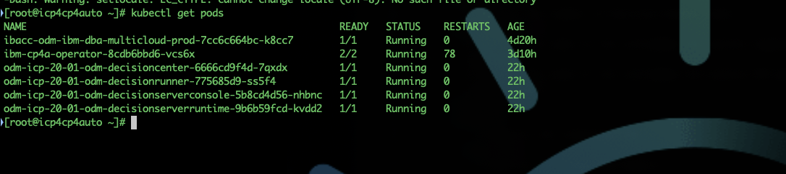

<!-- toc -->

- [Move IBACC to Operator](#Move-IBACC-to-Operator)
    + [IBACC](#IBACC)
    + [Deploy IBACC](#Deploy-IBACC)
    + [Install ODM](#Install-ODM)
  * [No worries. Everything is up](#No-worries-Everything-is-up)
    + [Verify ODM](#Verify-ODM)
  * [To move to Cloud pak for Automation delete this deployment](#To-move-to-Cloud-pak-for-Automation-delete-this-deployment)
  * [Installation of Cloud pak for Automation on ICP For Ravago !](#Installation-of-Cloud-pak-for-Automation-on-ICP-For-Ravago-)
    + [Connect to the rigth namespaces](#Connect-to-the-rigth-namespaces)
    + [Identify the image internal registry](#Identify-the-image-internal-registry)
    + [Push the images into a specific namespace](#Push-the-images-into-a-specific-namespace)
    + [create the secret for container credentials](#create-the-secret-for-container-credentials)
    + [apply the PVC - PV for the operator](#apply-the-PVC---PV-for-the-operator)
    + [Deploy operator](#Deploy-operator)
  * [ODM Installation](#ODM-Installation)
    + [Secret creation](#Secret-creation)
    + [Apply ODM deployement](#Apply-ODM-deployement)
    + [Follow the logs](#Follow-the-logs)
    + [List running pods](#List-running-pods)
    + [List the list of services :](#List-the-list-of-services-)

<!-- tocstop -->
# Move IBACC to Operator

### IBACC
 
Business Automation Configuration Container (IBACC) is used to deploy the core services of IBM® Digital Business Automation for Multicloud:




  * IBM® FileNet® Content Manager provides enterprise content management to enable secure access, collaboration support, content synchronization and sharing, and mobile support to engage users over all channels and devices. IBM® FileNet® Content Manager consists of IBM® Content Process Engine (CPE), Content Search Service (CSS) and Content Management Interoperability Service (CMIS).
  * IBM® Business Automation Navigator container is a Docker image that enables you to quickly deploy IBM® Business Automation Navigator (BAN) without a traditional software installation.
  * IBM® Operational Decision Manager (ODM) automates policies and decisions by managing thousands of business rules and enabling rapid business change.
  *  IBM® Business Automation Workflow (BAW) automates processes and cases for agility, visibility, and consistency across business operations.
  *  Business Automation Insights (BAI), a platform-level component, provides visualization and insights to knowledge workers and business owners. Business Automation Insights provides dashboarding and data science capabilities from the events and business data collected from Digital Business Automation for Multicloud services.

It's a container that manage the deployement of other product listed above.


### Deploy IBACC

!!! hint preparition 

 Update and Deploy PVC and PV configuration

 ```yaml
      apiVersion: v1
      kind: PersistentVolume
      metadata:
        name: ibacc-cfg-pv
      spec:
        accessModes:
        - ReadWriteMany
        capacity:
          storage: 1Gi
        nfs:
          path: /srv/nfs/icp/ibacc/
          server: xxxxxx
        persistentVolumeReclaimPolicy: Retain
        claimRef:
          namespace: odm-icp
          name: ibacc-cfg-pvc

      ---
      apiVersion: v1
      kind: PersistentVolumeClaim
      metadata:
        name: ibacc-cfg-pvc
        namespace: odm-icp
      spec:
        accessModes:
        - ReadWriteMany
        resources:
          requests:
            storage: 1Gi
        storageClassName: ibacc-cfg-pv
        volumeName: ibacc-cfg-pv
      status:
        accessModes:
        - ReadWriteMany
        capacity:
          storage: 1Gi
```
!!!

!!! note deployement IBACC

* Define the name of the deployment
* Select the namespaces target


* Configure the namespace where the ibacc container images are located.
* Update PVC volume name


!!!

!!! caution IF IBACC authorization fails to pull images

   create the secret for container credentials

      kubectl create secret docker-registry admin.registrykey --docker-server=mycluster.icp:8500 --docker-username=admin  --docker-password=xxxxxx --docker-email=malek@jabri.eu

  * kubectl get deployments 
    
  
  
  Edit the deployement to include the admin.registry secretkey 
  

       imagePullSecrets:
      - name: admin.registrykey


  
  
!!!
  
  ### Install ODM 
  
!!! note Install odm

  1) Navigate in the IBM Cloud Private console : Workload --> Helm Release
  2) Locate the IBACC deployement and click on launch


  4)  Click on get started


  5) Fill the name for the project


  7) Define global Configuration


  9) To retrieve token click on the configure client and copy the token generated for you.


10) select the poducts


11) define the products components configuration

12) Update the Shared Definition : LDAP & Database


13) Review and deploy


14) Follow the deployement master and IBM Operational Decision Manager:


  !!! caution Check failed in odm may happen

 ## No worries. Everything is up

  

  !!!
!!!


### Verify ODM 

1) List running pods status : 

    Kubectl get pods
    


2) Navigate using IBM Cloud provite console: Workload --> Helm RElease and locate the new deployment 


  You can open the different urls.
  
## To move to Cloud pak for Automation delete this deployment 


## Installation of Cloud pak for Automation on ICP For Ravago !

This is the short version of the github and the knowledge center which remains the official sources. 

*  [IBM Knowledge Center](https://www.ibm.com/support/knowledgecenter/SSYHZ8_20.0.x/com.ibm.dba.install/op_topics/tsk_prepare_env_k8s.html)
*  [GitHub - icp4a/cert-kubernetes: Certified Kubernetes Support for IBM Cloud Pak for Automation](https://github.com/icp4a/cert-kubernetes)

### Connect to the rigth namespaces
      
    kubectl config set-context mycluster-context --user=admin --namespace=odm-icp
    kubectl config use-context mycluster-context
      
      
    if not existant create one for the project : kubectl create namespace odm-icp
    
### Identify the image internal registry  

    mycluster.icp:8500

### Push the images into a specific namespace

Download the cert-kubernetes project from github: [GitHub - icp4a/cert-kubernetes: Certified Kubernetes Support for IBM Cloud Pak for Automation](https://github.com/icp4a/cert-kubernetes)

      mycluster.icp:8500/"namespace"

      Operator Images:
      ./scripts/loadimages.sh -p ../../binairis/ICP4A20.0.1-opf.tgz -r mycluster.icp:8500/default
      ODM images: 
      ./scripts/loadimages.sh -p ../binairies/ICP4A20.0.1-odm.tgz -r mycluster.icp:8500/default
      Filenet Images: 
       ./scripts/loadimages.sh -p ../../binairis/ICP4A20.0.1-fncm.tgz -r mycluster.icp:8500/default
      
### create the secret for container credentials

      kubectl create secret docker-registry admin.registrykey --docker-server=mycluster.icp:8500 --docker-username=admin  --docker-password=xxxxxx --docker-email=malek@jabri.eu
      
### apply the PVC - PV for the operator 

  Create the storage spaces : 
  
  * mkdir -p path/operator/jdbc/db2
  * Adapt the operator pv and pvc
    
    ```yaml
        apiVersion: v1
        kind: PersistentVolume
        metadata:
          labels:
            type: local
          name: operator-shared-pv
        spec:
          capacity:
            storage: 1Gi
          accessModes:
            - ReadWriteMany
          nfs:
            path: path/operator/
            server: xxxxxx
          persistentVolumeReclaimPolicy: Delete
          claimRef:
            namespace: odm-icp
            name: operator-shared-pvc
        ---

        apiVersion: v1
        kind: PersistentVolumeClaim
        metadata:
          name: operator-shared-pvc
          namespace: odm-icp
        spec:
          accessModes:
            - ReadWriteMany
          storageClassName: ""
          resources:
            requests:
              storage: 1Gi
          volumeName: operator-shared-pv

  *  Kubectl apply -f op-pv-pvc.yaml
    
   Copy the db2 client jar (For info, db2 jar are also available in the cert-kubernetes project : cert-kubernetes/scripts/jdbc)
    
  
    
### Deploy operator 

    ./scripts/deployOperator.sh -i mycluster.icp:8500/default/icp4a-operator:20.0.1 -p admin.registrykey -a accept

## ODM Installation 

    1) Apply secrets
    2) Apply the deployement definition

### Secret creation

    kubectl create secret generic odm-db-secret --from-literal=db-user='xxxx' --from-literal=db-password='xxx'

    kubectl apply -f ldap-secrets.yaml

### Apply ODM deployement

    Define the database 
    
```yaml
    
       dc_odm_datasource:
       dc_database_type: "db2"
       database_servername: "xxxxxxx"
       dc_common_database_port: "50000"
       dc_common_database_name: "xxxx"
       dc_common_database_instance_secret: "odm-db-secret"
```
       
  Define the ODM
  
```yaml
odm_configuration:
          #   # Allow to activate more trace for ODM in the Operator pod.
            debug: false
          #   # Allow to specify which version of ODM you want to deploy.
          #   # Supported version > 19.0.2
          #   # If omitted the latest version will be used.
            version: 20.0.1
            image:
          #     # Specify the repository used to retrieve the Docker images if you do not want to use the default one.
              repository: "mycluster.icp:8500/default"
          #     # Specify the tag for the Docker images.
          #     # It's a Mandatory tag when you enable odm_configuraton.
              tag: 8.10.3.0_ICP2001
          #     # Specify the pull policy for the Docker images. See Kuberntes documentation for more inforations.
          #     # Possible values : IfNotPresent, Always, Never
              pullPolicy: IfNotPresent
              # Optionally specify an array of imagePullSecrets.
          #     # Secrets must be manually created in the namespace.
          #     # Ex: pullSecrets: "mypullsecret"
              pullSecrets: "admin.registrykey"
          #
          #   service:
          #     Specify whether to enable Transport Layer Security. If true, ODM web apps are accessed through HTTPS. If false, they are accessed through HTTP.
          #    enableTLS: false
              # Specify the service type.
        #      type: NodePort
          #
          #   ## Decision Server Runtime parameters
            decisionServerRuntime:
          #     # Specify whether to enable Decision Server Runtime.
              enabled: true
          #     # Specify the number of Decision Server Runtime pods.
              replicaCount: 1
          #     # Specify the name of the configMap the wanted logging options. If left empty, default logging options are used.
          #     loggingRef:
          #     # Specify the name of the configMap the wanted JVM options. If left empty, default JVM options are used.
          #     jvmOptionsRef:
          #     # Specify the name of the configmap that contains the XU configuration property file.
          #     xuConfigRef:
              resources:
                requests:
                  # Specify the requested CPU.
                  cpu: 500m
          #         Specify the requested memory.
                  memory: 512Mi
                limits:
          #         # Specify the CPU limit.
                  cpu: 2
          #         # Specify the memory limit.
                  memory: 4096Mi
          #   ## Decision Server Console parameters
            decisionServerConsole:
          #     # Specify the name of the configMap the wanted logging options. If left empty, default logging options are used.
          #     loggingRef:
          #     # Specify the name of the configMap the wanted JVM options. If left empty, default JVM options are used.
          #     jvmOptionsRef:
              resources:
                requests:
          #         # Specify the requested CPU.
                  cpu: 500m
          #         # Specify the requested memory.
                  memory: 512Mi
                limits:
          #         # Specify the CPU limit.
                  cpu: 2
          #         # Specify the memory limit.
                  memory: 1024Mi
          #   ## Decision Center parameters
            decisionCenter:
          #     # Specify whether to enable Decision Center.
              enabled: true
          #     # Specify the persistence locale for Decision Center.
          #     # Possible values  "ar_EG" (Arabic - Egypt), "zh_CN" (Chinese - China), "zh_TW" (Chinese - Taiwan)
          #     # "nl_NL" (Netherlands), "en_GB" (English - United Kingdom), "en_US" (English - United States),
          #     # "fr_FR" (French - France), "de_DE" (German - Germany), "iw_IL" (Hebrew - Israel), "it_IT" (Italian - Italy),
          #     # "ja_JP" (Japanese - Japan) , "ko_KR" (Korean - Korea), "pl_PL" (Polish - Poland),
          #     # "pt_BR" (Portuguese - Brazil), "ru_RU" (Russian - Russia), "es_ES" (Spanish - Spain)
              persistenceLocale: en_US
          #     # Specify the number of Decision Center pods.
              replicaCount: 1
          #     # Persistent Volume Claim to access the custom libraries
          #     customlibPvc:
          #     # Specify the name of the configMap the wanted logging options. If left empty, default logging options are used.
          #     loggingRef:
          #     # Specify the name of the configMap the wanted JVM options. If left empty, default JVM options are used.
          #     jvmOptionsRef:
              resources:
                requests:
          #         # Specify the requested CPU.
                  cpu: 500m
          #         # Specify the requested memory.
                  memory: 1500Mi
                limits:
          #         # Specify the CPU limit.
                  cpu: 2
          #         # Specify the memory limit.
                  memory: 4096Mi
          #   ## Decision Runner parameters
            decisionRunner:
          #     # Specify whether to enable Decision Runner.
              enabled: true
          #     # Specify the number of Decision Runner pods.
              replicaCount: 1
          #     # Specify the name of the configMap the wanted logging options. If left empty, default logging options are used.
          #     loggingRef:
          #     # Specify the name of the configMap the wanted JVM options. If left empty, default JVM options are used.
          #     jvmOptionsRef:
              resources:
              requests:
          #       # Specify the requested CPU.
                cpu: 500m
          #       # Specify the requested memory.
                memory: 512Mi
              limits:
          #       # Specify the CPU limit.
                cpu: 2
          #       # Specify the memory limit.
                memory: 4096Mi

          #   ## Database - Option 2: External (DB2 or PostgreSQL)
          #   ## Fill in the parameters to use an external DB2 or PostgreSQL database.
            externalDatabase:
          #     # Specify the type of the external database. If this parameter is left empty, PostgreSQL is used by default.
          #     # Possible values : "db2", "postgresql"
              type: "db2"
          #     # Specify the name of the server running the external database. If it is not specified, the PostgreSQL internal database is used.
              serverName: "xxxxxxx"
          #     # Specify the name of the external database.
              databaseName: "odmicp"
          #     # Specify the name of the secret that contains the credentials to connect to the external database.
              secretCredentials: "odm-db-secret"
          #     # Specify the port used to connect to the external database.
              port: "50000"

          #  networkPolicy:
          #     # Enable creation of NetworkPolicy resources.
          #    enabled: true
          #     # For Kubernetes v1.4, v1.5 and v1.6, use 'extensions/v1beta1'
          #     # For Kubernetes v1.7, use 'networking.k8s.io/v1'
          #    apiVersion: networking.k8s.io/v1

```
### Follow the logs 

    kubectl logs ibm-cp4a-operator-8cdb6bbd6-vcs6x -c operator -f


### List running pods 

      Kubectl get pods -w
      
  

### List the list of services :

      Kubectl get services

  
  
      Retrieve the list ports to access the differnets applicaiton 
  
  

    For example, decision center url : 

        https://mycluster.icp:30763/
        
